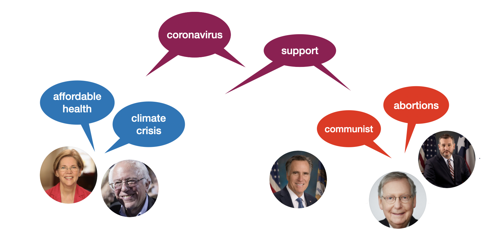

# Partisan Phrases

Materials I used in a blog post. The idea for using VoteSmart data to calculate bias came from the paper, "Auditing the partisanship of Google search snippets" by Robertson et al.
